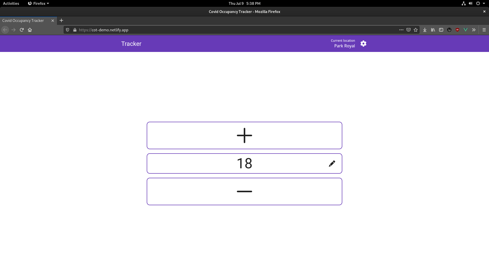
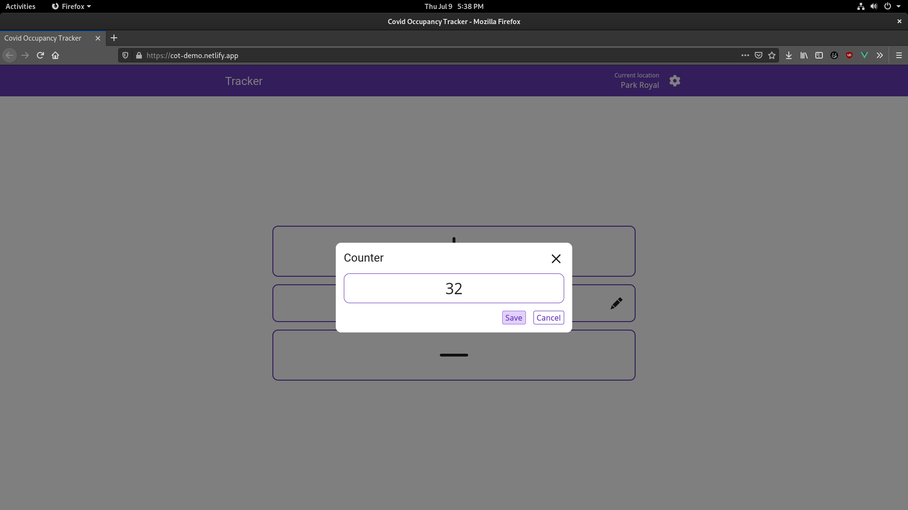
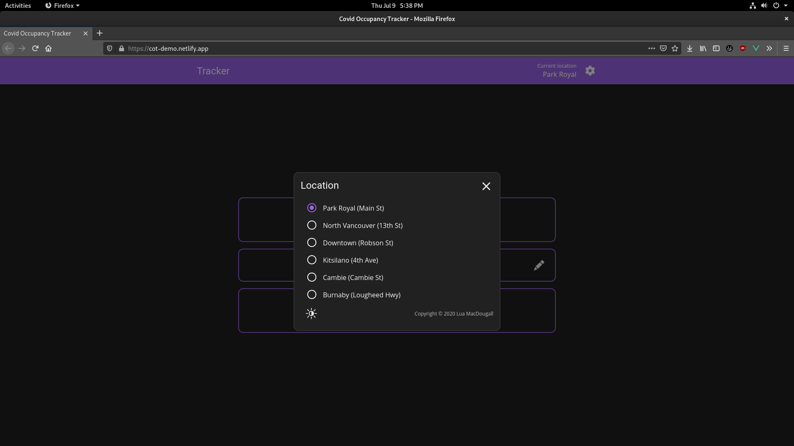
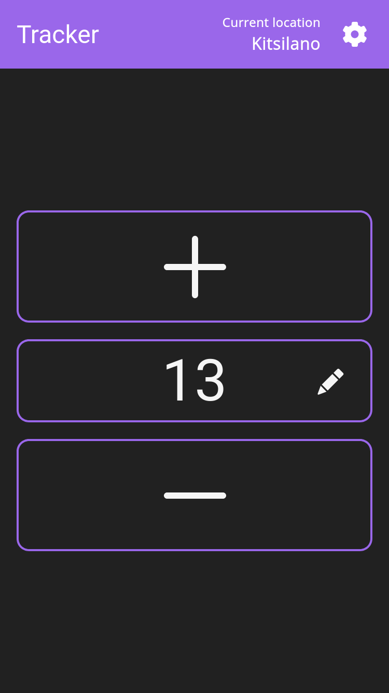
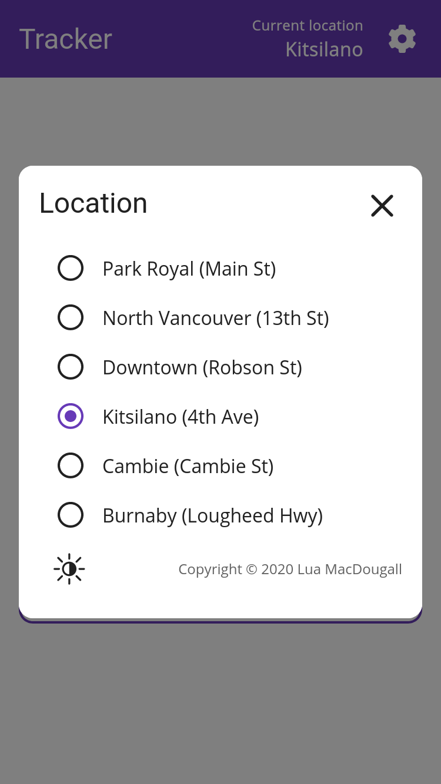

<h1 align="center">
CovidOccupancyTracker
</h1>
<p align="center"><i>
Webapp for tracking the number of people in a building, designed for a specific grocery store chain.
</i></p>

## Introduction
The CovidOccupancyTracker *\<COT\>* is a website that facilitates the accurate counting of the number of people currently in a building where every entrance/exit is staffed with someone like a "greeter".
All greeters can increase/decrease/set the number of people in the store, incrementing the number when somebody enters and decrementing the number when somebody leaves.
The changes are synced over the internet, allowing an accurate count even if someone were to enter from one door and leave out the other, or if greeters need to switch (shift change).

How about a [live demo](https://cot-demo.netlify.app/)?

## Screenshots
### Desktop




### Mobile
|                                 |                                 |
| ------------------------------- | ------------------------------- |
|  |  |


## Technology
COT is written in [TypeScript](https://www.typescriptlang.org/), a superset of [JavaScript](https://wikipedia.org/wiki/JavaScript). It uses the [Vue.js](https://vuejs.org/) framework for rendering its user interface and the [Vuex](https://vuex.vuejs.org/) state management library for keeping track of program state. The internet syncing capabilities are powered by the [Google Firebase Firestore](https://firebase.google.com/) database, COT uses Firestore's snapshot listener features for automatic updating on all clients and the Firestore `FieldValue` system for atomic updates.

## Setup
Before downloading the source code for COT, you must create a Firebase project with Firebase Firestore (required) and possibly Firebase Analytics/Firebase Performance (optional).
For more information, start [here](https://firebase.google.com/docs/web/setup).

To setup a development environment for COT, please make sure you have the following tools installed:
 - Git
 - Node.js
 - NPM

Then, in a compatible shell, run these commands to clone and set up the repository:
```sh
git clone https://github.com/luawtf/CovidOccupancyTracker
cd CovidOccupancyTracker
npm install
```

Now create a new file called `config.ts` in the `src/` folder:
```sh
touch src/config.ts
```
And open the newly created configuration file with your favorite text editor, then fill it out to look something like this example:
```typescript
import { LocationConfiguration } from "@/locations";

// Locations to present to the user
export const locationConfig: LocationConfiguration = [
	{ id: "wvan",		name: "Park Royal",		street: "Main St", default: true },
	{ id: "nvan",		name: "North Vancouver",	street: "13th St"	},
	{ id: "robson",		name: "Downtown",		street: "Robson St"	}
];

// Firebase configuration object
export const firebaseConfig = {
	apiKey: "XXXXXXXXXXXXXXXXXXXXXXXXXXXXXXXXXXXXXXX",
	authDomain: "XXXXXXXXXXXXXX.firebaseapp.com",
	databaseURL: "https://XXXXXXXXXXXXXX.firebaseio.com",
	projectId: "XXXXXXXXXXXXXX",
	storageBucket: "XXXXXXXXXXXXXX.appspot.com",
	messagingSenderId: "XXXXXXXXXXXX",
	appId: "XXXXXXXXXXXXXXXXXXXXXXXXXXXXXXXXXXXXXXXXX"
};

// Optional Firebase features
export const firebaseFeatures = {
	analytics: false,
	performance: false
};
```

Finally, start the development server!
```sh
npm run serve
# or for production
npm run build
```

## Contributing
No contributions are being accepted to this repository at this time.
However, please consider making a fork of this repository on GitHub if you wish to change something.

## Authors
Made with ❤ by Lua MacDougall ([lua.wtf](https://lua.wtf/))

## License
This project is licensed under [MIT](LICENSE).
More info in the [LICENSE](LICENSE) file.

*"A short, permissive software license. Basically, you can do whatever you want as long as you include the original copyright and license notice in any copy of the software/source. There are many variations of this license in use."* - [tl;drLegal](https://tldrlegal.com/license/mit-license)
